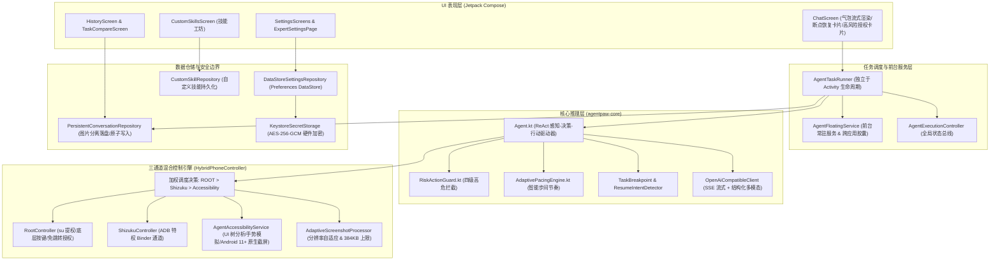
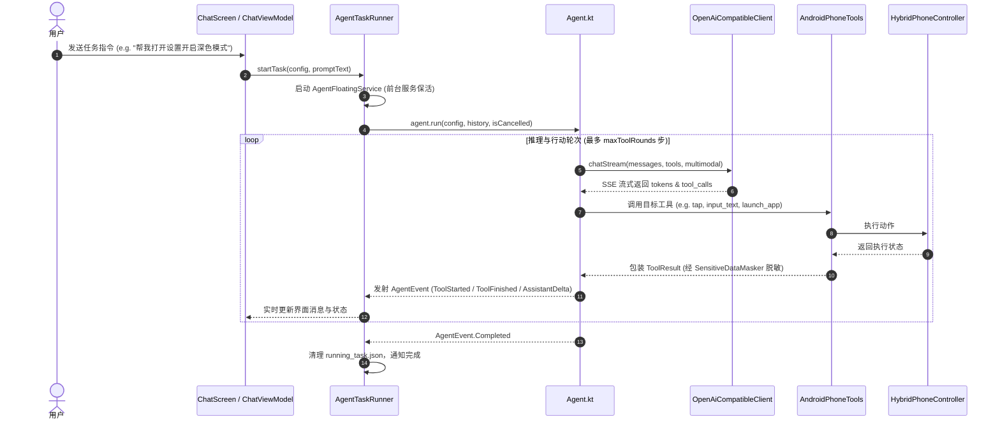
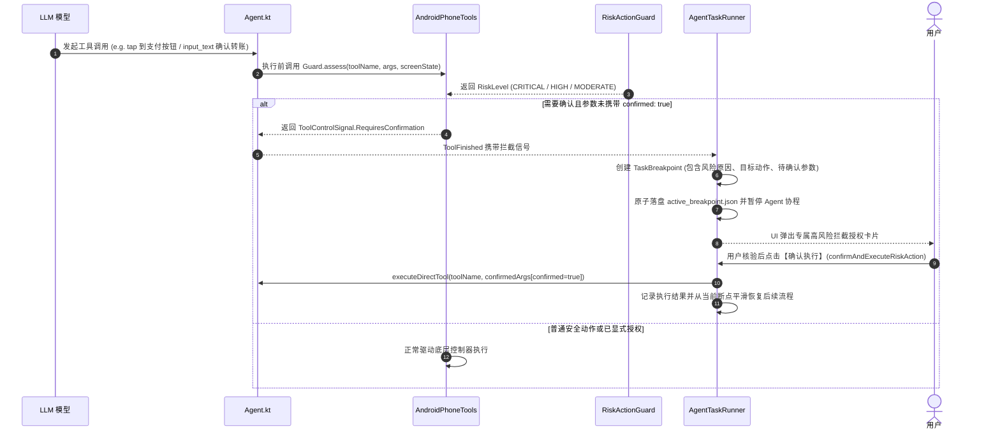

# AgentPaw 系统架构与设计文档 (ARCHITECTURE)

> 本文档基于对当前代码库实际组件、调用链与数据流的真实调查建立。
> 更新时间：2026-10-10

---

## 1. 系统架构全景



---

## 2. 关键调用链与数据流

### 2.1 任务启动与执行主循环 (Execution Loop)



### 2.2 三通道混合控制调度策略 (Root > Shizuku > Accessibility)

当 `HybridPhoneController` 接收到交互指令（如 `tap(xNormalized, yNormalized)`）时，严格遵循以下阶梯式调度链路：

```text
[接收指令与归一化坐标]
       │
       ▼
 检查是否已被用户请求停止 (AgentAccessibilityService.isStopRequested)
       │ (否)
       ▼
 坐标还原: toPhysical() 基于最近一次截图物理分辨率映射为实际像素
       │
       ▼
【第 1 优先级】Root 引擎可用？(isRootAllowed: controlMode == ROOT/AUTO && root.isAvailable)
       ├── 是 ──> 执行 rootController.tap(x, y) ──> 成功 ──> 延时稳定 ──> 返回 true
       └── 否 / 失败
              │
              ▼
【第 2 优先级】Shizuku 引擎可用？(isShizukuAllowed: shizuku.isAvailable)
       ├── 是 ──> 执行 shizukuController.tap(x, y) ──> 成功 ──> 延时稳定 ──> 返回 true
       └── 否 / 失败
              │
              ▼
【第 3 优先级 (兜底)】无障碍服务可用？(AgentAccessibilityService.instance != null)
       ├── 是 ──> 执行 service.clickAt(x, y) ──> 成功 ──> 延时稳定 ──> 返回 true
       └── 否 / 失败 ──> 降级失败，返回 false
```

### 2.3 高风险操作拦截与二次确认 (Risk Action Guard)



### 2.4 断点续操与防重复执行机制

1. **断点捕获**：用户点击红色停止胶囊、或系统检测到高危操作、或进程意外终止时，自动抓取 `StepSnapshot` 列表，包含各步骤工具名、精简参数、执行结果与在途回滚状态。
2. **意图解析**：当用户输入“继续”、“继续执行刚才的操作”或“从第3步继续”时，`ResumeIntentDetector` 识别为续操意图。
3. **上下文动态注入**：生成系统级严格防重提示词 `【断点续操恢复指令（严格执行）】`，列出已完成的步骤清单，明确严禁大模型重复执行上一轮已完成的点击或输入操作。

---

## 3. 安全架构与隐私边界

1. **凭据隔离与硬件加密**：
   - 使用 Android KeyStore AES-256-GCM 进行密钥加密。
   - `KeystoreSecretStorage` 确保磁盘中只存储 `enc:gcm:<base64>` 密文。
   - 配置 `backup_rules.xml` 与 `data_extraction_rules.xml`，阻断 Android 云备份与 adb 提取。
2. **网络通信合规**：
   - 第三方公网 LLM 强制 HTTPS 通信。
   - 本地内网（`10.0.2.2`, `127.0.0.1`, `localhost`, `192.168.x.x`）允许 HTTP 明文调试。
3. **命令注入防御**：
   - `ShellEscape.quoteForSh()` 对 Root 与 Shizuku 的 Shell 参数使用强单引号包裹与单引号转义，杜绝 `; rm -rf` 等拼接式命令注入漏洞。
   - 进程内脚本沙箱限制在 `filesDir/sandbox` 根目录下，严格拒绝相对路径穿透（`../`）。
4. **视觉与日志脱敏**：
   - `SensitiveDataMasker` 在日志展示前剔除 API Key、Bearer Token 及超过 300 字符的 Base64 媒体串。
   - 截屏文件落盘采用单独的 `images/` 目录与 `file://` 协议引用，清空会话时进行物理级删除。
