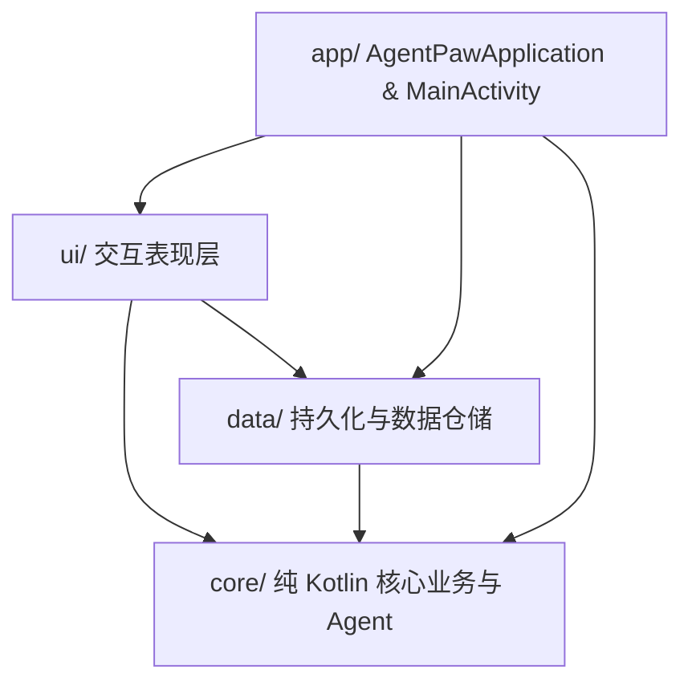
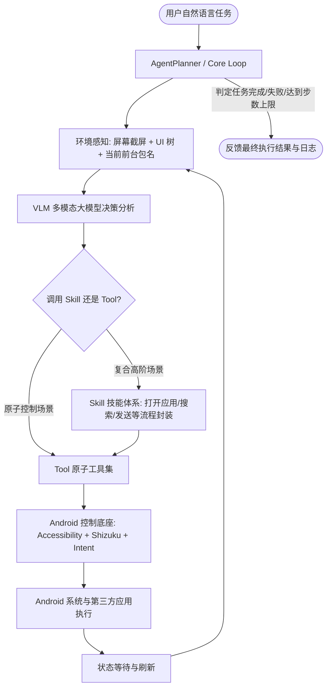

# AgentPaw 手机 Agent 架构审计与实施路线图

> 本文档基于对当前项目完整源码、构建环境、依赖配置以及 GitHub 开源项目「肉包（Roubao）」核心设计思想的深度审计与梳理制定。

---

## 一、 当前项目架构全景与现状审计

### 1.1 现有分层架构

- **`core/` (纯 Kotlin 层)**:
  - `agent/`: `Agent.kt`（核心循环驱动器）、`AgentTool.kt`（工具接口与注册表 `ToolRegistry`、上下文 `AgentContext`）。
  - `llm/`: `LlmClient.kt`（模型通用契约）、`LlmConfig.kt`（LLM 配置模型）、`OpenAiCompatibleClient.kt`（基于 OkHttp + SSE 的通用 OpenAI 兼容客户端）、`ChatCompletionDto.kt`（序列化 DTO）。
  - `model/`: `Message.kt`、`Conversation.kt`。
  - `shell/`: 纯 Kotlin 实现的 AST 词法语法解析与沙箱解释器（~30 个基础命令）。
  - `search/`: `DuckDuckGoSearchBackend.kt`。
  - `tool/`: `ShellTool.kt`、`WebSearchTool.kt`、`SubAgentTool.kt`。

- **`data/` (数据仓储层)**:
  - `settings/`: `DataStoreSettingsRepository.kt`（使用 AndroidX DataStore 存储提供商、BaseURL、API Key、采样参数）。
  - `conversation/`: `ConversationRepository.kt`（内存仓储 `InMemoryConversationRepository`）。

- **`ui/` (Jetpack Compose 视图层)**:
  - `chat/`: `ChatScreen.kt`、`ChatViewModel.kt`、`MessageBubble.kt`。
  - `settings/`: `LlmSettingsScreen.kt`、`LlmSettingsViewModel.kt`。
  - `navigation/`: `AgentPawApp.kt`（双路由 `chat` 与 `settings`）。

---

## 二、 现有功能与未完成功能清单（Feature Matrix）

| 模块 | 已经完成的功能 | 缺失 / 待完善能力 |
|---|---|---|
| **Agent 执行闭环** | 多轮对话驱动、Tool 调用分发、子 Agent 委派深度限制 | 缺少视觉/环境感知（屏幕截屏+UI树分析）、缺少手机自主执行闭环（任务拆解→屏幕感知→决策动作→验证反馈）、缺乏操作失败重试及自动纠偏、最大步数硬编码（8 轮）不可配置 |
| **Tool 工具系统** | 沙箱 Shell、DuckDuckGo 搜索、Sub-Agent 委派 | **无任何手机控制工具**：缺少截屏（Screenshot）、点击（Tap/Click）、长按（LongPress）、滑动/滚动（Swipe/Scroll）、输入文字（InputText）、返回键（Back）、主屏幕键（Home）、最近任务（Recents）、启动 App（LaunchApp）、DeepLink 跳转、获取界面状态（UI Node Hierarchy / Current App） |
| **Skill 技能体系** | 仅有单级 Tool 概念 | 缺少肉包式的 Tools + Skills 双层架构。复合操作（如“发微信消息”、“导航”、“外卖点餐”、“搜索播放音乐”等）缺乏技能抽象与注册器，无法动态扩展技能库与组合复用 |
| **多模态与模型层** | OpenAI 兼容接口、SSE 流式解析、单 Token 连通性测试 | `ChatMessage` 仅支持纯文本 `content: String?`，**无法发送 Base64 截图给多模态视觉模型 (VLM)**；缺少视觉尺寸压缩优化；缺少超时重试、Qwen/Gemini/Ollama 兼容特殊处理 |
| **Android 控制层** | 仅标准 App 基础权限（INTERNET, NETWORK_STATE） | 缺少无障碍服务（`AccessibilityService`）实现；缺少 Shizuku 权限集成与 Shell 降级机制；缺少无感屏幕截屏能力与前台浮窗/服务保障 |
| **UI 与交互系统** | Material 3 动效主题、基本聊天气泡、LLM 基础设置界面 | UI 完全忽略了工具调用中间态（`ToolStarted`/`ToolFinished` 被静默丢弃）；缺少权限引导管理界面（无障碍、Shizuku、悬浮窗）；缺少 Agent 步数上限配置与执行日志可视化面板；缺少跨应用悬浮控制球/悬浮胶囊 |

---

## 三、 审计发现的代码缺陷与问题清单（Bug & Debt List）

1. **`ChatScreen.kt` 顶部按钮绑定错误**:
   - `ChatScreen.kt` 第 97 行 TopAppBar 操作按钮图标为 `Icons.Outlined.Settings`，但 `onClick` 错误绑定到了 `onNewConversation`，导致在聊天有内容时无法直接进入设置页面。
2. **UI 丢弃工具执行过程事件**:
   - `ChatViewModel.kt` 第 133 行：`is AgentEvent.ToolStarted, is AgentEvent.ToolFinished -> Unit`，导致模型调用工具的过程对用户完全黑盒，手机自动操作时用户无法感知当前动作。
3. **架构分层污染**:
   - `LlmConfig.kt` 引入了 `@androidx.compose.runtime.Immutable` 注解，违反了 `core/` 是纯 Kotlin 不依赖 Android/Compose 的架构约束。
4. **消息格式不支持多模态视觉 (VLM)**:
   - `ChatCompletionDto.kt` 的 `ChatMessage` 定义中 `content` 字段仅为 `String?`，无法按照 OpenAI/VLM 规范构造包含 `image_url`（`data:image/jpeg;base64,...`）的复合多模态内容。
5. **最大工具轮数硬编码**:
   - `Agent.kt` 中固定为 `DEFAULT_MAX_TOOL_ROUNDS = 8`，未从 `LlmConfig` 或 `AppSettings` 注入，且设置页面无法调整。

---

## 四、 参考「肉包（Roubao）」的核心设计落地规划

肉包的核心设计精髓在于：**Tools + Skills 双层架构** + **Shizuku / 无障碍双控制引擎** + **“感知-决策-行动-反馈”闭环执行器** + **安全红线机制**。我们在 AgentPaw 中将这一思想融入现有架构：

---

## 五、 分模块实施阶段规划与完成状态（已全部落地）

### 阶段一：基础与模型层完善（VLM 多模态 + 核心 Bug 修复）[已完成 ✔]
- [x] 修复 `ChatScreen.kt` 顶部设置按钮与新建会话按钮的独立绑定问题。
- [x] 移除 `core/llm/LlmConfig.kt` 中对 Compose 的依赖，彻底恢复 `core/` 纯 Kotlin 层约束。
- [x] 升级 `ChatMessage` 与 DTO，支持多模态内容（文本 + Base64 屏幕截图），并兼容 OpenAI、Qwen-VL、Gemini、Ollama。
- [x] 将 `maxToolRounds`（最大步数）与 `visionResolutionMode` 纳入 `LlmConfig` 与 `AppSettings`，并在 Settings 界面提供 5~50 步调节及自适应分辨率选择。

### 阶段二：Android 控制底座建设（Accessibility + Shizuku + Intent）[已完成 ✔]
- [x] 实现 `AgentAccessibilityService`：
  - 支持无障碍手势模拟（点击、长按、双击、滑动）。
  - 支持系统级动作（返回、Home、任务列表、回车）。
  - 支持 UI 树遍历（获取当前屏幕可视元素列表、文本、位置边界、可点击属性）。
  - 支持 Android 11+ 无障碍原生截屏接口。
- [x] 实现 `ShizukuController` 与 Shell 执行通道（支持通过 Shizuku 执行免 Root 截屏与指令，并在未授权时平滑降级至无障碍）。
- [x] 实现 `HybridPhoneController`（智能混合双通道控制底座，Shizuku 优先，无缝自动降级）。

### 阶段三：可扩展 Tool 工具箱（手机操作原子能力）[已完成 ✔]
- [x] 实现 `TakeScreenshotTool`（结合 `AdaptiveScreenshotProcessor` 智能自适应分辨率与 ROI 裁剪，节省 80%+ Tokens）。
- [x] 实现 `TapTool`（归一化 0..1000 坐标系统，自动适配物理分辨率）。
- [x] 实现 `DoubleTapTool`（双击操作支持）。
- [x] 实现 `LongPressTool`（长按指定坐标，可调节时长）。
- [x] 实现 `SwipeTool`（支持平滑滚动与滑动）。
- [x] 实现 `InputTextTool`（输入文本，支持自动清空与回车）。
- [x] 实现 `KeyActionTool`（返回、Home、Recents、Enter 等系统键）。
- [x] 实现 `LaunchAppTool` 与 `DeepLinkTool`（应用启动与协议直达）。
- [x] 实现 `GetScreenStateTool`（结构化当前前台包名及 UI 节点）。
- [x] 实现 `WaitTool`（明确等待页面加载与动画平息）。

### 阶段四：Skill 技能体系（复合能力封装与解耦）[已完成 ✔]
- [x] 定义 `AgentSkill` 接口、`SkillRegistry` 与 `SkillToolAdapter`。
- [x] 实现基础与高阶通用技能：
  - `OpenAndSearchSkill`（打开指定应用并自动定位搜索框输入搜索）。
  - `ReturnHomeAndResetSkill`（安全回到桌面并重置状态）。
  - `ScrollAndFindSkill`（智能在列表或页面中平滑滚动查找目标并点击，大幅减少视觉往返，极大节省 Token）。

### 阶段五：Agent 执行闭环与安全容错 [已完成 ✔]
- [x] 升级 `Agent.kt` 执行引擎：
  - 视觉感知闭环：执行动作后回传 observation 截屏（精简 summary + Base64 image），防止上下文超限溢出。
  - 安全红线机制（`SafetyGuard`）：检测到支付、密码输入等敏感页面时自动暂停并提示用户接管。
  - 步数自适应保护与协程取消响应。

### 阶段六：UI 与实时状态同步 [已完成 ✔]
- [x] 完善 `ChatViewModel` 与 `MessageBubble`：
  - 工具调用过程实时上屏（`ToolStarted` 动态展示当前执行工具与参数，`ToolFinished` 展示执行结果与状态）。
  - 支持渲染多模态截屏缩略图。
- [x] 完善 `LlmSettingsScreen`：
  - “手机控制与系统权限”专区：实时检测无障碍、Shizuku、悬浮窗状态，提供一键引导开启按钮。
  - “Agent 手机控制与视觉策略”专区：自适应分辨率模式选择、最大执行步数调节。
- [x] 跨应用控制体验：
  - 实现 `AgentFloatingService` 悬浮药丸胶囊与 `AgentExecutionController` 状态总线，在操作第三方 App 时实时展示步数、当前动作与一键停止按钮。
  - 聊天界面顶部未开启无障碍时展示智能提示横幅。

### 阶段七：系统验证与单元测试 [已完成 ✔]
- [x] 全工程自动化单元测试（涵盖 DTO、工具、技能、截屏处理器、状态机控制器全部通过，`BUILD SUCCESSFUL`）。

