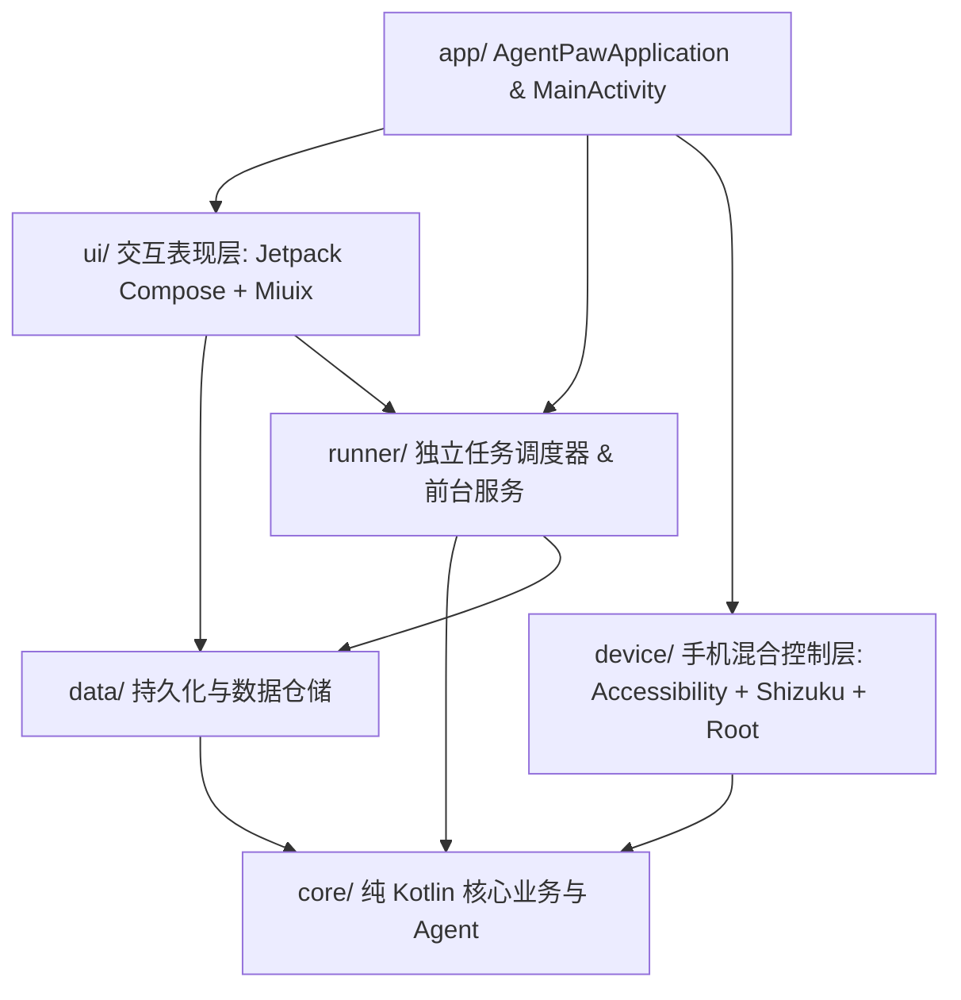
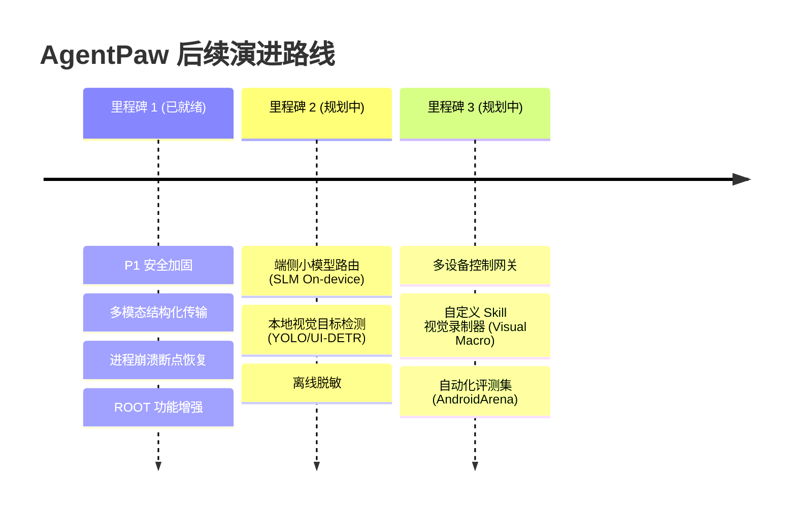

# AgentPaw 手机 Agent 架构审计与技术路线图

> 本文档基于对当前 AgentPaw 完整源码、构建环境、安全边界、多模态执行闭环及「肉包（Roubao）」核心设计思想的最新技术审计制定。
> 最近更新：2026 年（已完成核心 P1 安全与稳定性重构，接入 Keystore 密钥加密、高风险操作中断确认、截屏脱敏与多模态控制闭环）。

---

## 一、 当前项目架构全景

- **`core/` (纯 Kotlin 模块，无 Android SDK 依赖)**:
  - `agent/`: `Agent.kt`（感知-决策-行动核心循环驱动器）、`RiskActionGuard.kt`（四级高风险动作评估引擎）、`SensitiveDataMasker.kt`（API Key、Token、超长 Base64 敏感数据脱敏过滤器）、断点管理 `TaskBreakpoint.kt`。
  - `llm/`: `LlmClient.kt`、`LlmConfig.kt`、`OpenAiCompatibleClient.kt`（OkHttp + SSE 流式协议支持，自动组装 OpenAI 标准结构化 `image_url` 多模态 payload）。
  - `model/`: `Message.kt`（多模态图像列表、`fullLog` 完整脱敏日志）、`Conversation.kt`。
  - `tool/`: 手机控制工具箱（Tap、DoubleTap、LongPress、Swipe、InputText、KeyAction、LaunchApp、DeepLink、TakeScreenshot、GetScreenState、Wait）、沙箱 `ShellTool.kt`、`WebSearchTool.kt`。
  - `skill/`: 肉包式双层技能体系（`AgentSkill`、`SkillRegistry`、`ScrollAndFindSkill`、`OpenAndSearchSkill`、`ReturnHomeAndResetSkill`）。

- **`data/` (数据与安全仓储层)**:
  - `settings/`: `DataStoreSettingsRepository.kt` + `KeystoreSecretStorage.kt`（基于 Android Keystore AES-256-GCM 硬件加密安全存储 API Key，旧配置透明迁移；配置 `backup_rules.xml` 与 `data_extraction_rules.xml` 严格排除明文云同步与跨设备转移）。
  - `conversation/`: `PersistentConversationRepository.kt`（异步带锁磁盘持久化、`isInitialized` 状态流避免加载覆盖刚发送任务的竞态、基于 `Dispatchers.IO` 的临时文件原子替换与清空会话自动媒体清理）。

- **`device/` (三通道混合手机控制引擎)**:
  - `AgentAccessibilityService`: 无障碍手势模拟（点击/滑动/长按）、系统动作（Back/Home/Recents）、全量 UI 节点树检索与 Android 11+ 原生截屏。
  - `ShizukuController`: 基于 Shizuku Binder 通道执行特权 Shell 指令与免 Root 截屏，支持未就绪时平滑回退。
  - `RootController`: 深度支持 Magisk / KernelSU / APatch 环境，具备 Su 命令执行能力与一键静默激活无障碍服务通道。
  - `HybridPhoneController`: 融合三通道，采用高精准度加权算法（精确匹配 100 > 包名 95 > 前缀 80 > 子串匹配）启动目标 App，杜绝模糊匹配误触。

- **`runner/` & `ui/` (任务调度与交互表现层)**:
  - `AgentTaskRunner`: 独立于 Activity 生命周期的任务执行器，管理中断断点、落盘任务快照（支持进程被杀/重启后恢复），绑定 `AgentFloatingService` 跨应用胶囊。
  - `ChatScreen.kt` / `MessageBubble.kt`: 视觉与语言分流（Split Vision-Language Mode）、工具调用实时状态与折叠代码块完整日志展示、Android 13+ 运行时通知授权、ROOT 状态检测与一键激活。

---

## 二、 核心特性矩阵（Feature Matrix）

| 模块 | 实现状态 | 详细能力与架构保证 |
|---|---|---|
| **多模态视觉感知** | ✔ 已实现 | 统一结构化 `image_url` 发送；`AdaptiveScreenshotProcessor` 自适应分辨率与 384KB 单图严格字节上限；工具回传仅保留摘要与脱敏占位，避免 Base64 塞满 LLM 文本上下文。 |
| **高风险动作拦截** | ✔ 已实现 | `RiskActionGuard` 四级风险机制（CRITICAL / HIGH / MODERATE / LOW）。针对支付、删除、转账、敏感授权、DeepLink 敏感协议以及含确认的文本输入，触发 `requires_confirmation` 并自动转为断点暂停，必须由用户显式核准。 |
| **密钥硬件加密** | ✔ 已实现 | `KeystoreSecretStorage` 依托 AndroidKeyStore 安全芯片 (AES-256-GCM) 硬件级加密存储 API Key；排除 Google Cloud 备份与换机迁移导出；JVM 测试环境平滑兼容降级。 |
| **会话持久化与竞态** | ✔ 已实现 | 引入 `isInitialized` 状态流；会话初始化完成前禁用发送与追加并展示占位；采用当前状态与磁盘合并策略，即使在慢设备上也不会发生刚发出的首条任务被本地历史覆盖的问题。 |
| **进程死亡恢复** | ✔ 已实现 | `AgentTaskRunner` 自动将进行中的任务目标与断点快照原子序列化至 `active_breakpoint.json` 与 `running_task.json`；进程被杀或重启后启动时自动加载并提醒用户“任务被中断，可查看/继续/放弃”。 |
| **执行日志可观测性** | ✔ 已实现 | `Message.fullLog` 完整保留工具原始输出；集成 `SensitiveDataMasker` 自动对 Token、密钥与超长媒体串脱敏；UI 提供折叠气泡与 Monospace 代码块视图，支持全量展开排查错误。 |
| **三通道控制与 ROOT** | ✔ 已实现 | 支持 Accessibility + Shizuku + Root 三引擎；设置页与聊天页提供 ROOT 授权状态监测；在已拥有 ROOT 的设备上一键静默执行 `settings put` 免跳转激活无障碍服务。 |
| **运行时权限规范** | ✔ 已实现 | Android 13+ (API 33+) 通过 `rememberLauncherForActivityResult` 与 `POST_NOTIFICATIONS` 发起原生授权请求，拒绝后智能引导至系统通知设置。 |
| **媒体存储生命周期** | ✔ 已实现 | 图片提取与落盘全程置于 `Dispatchers.IO` 并通过 `.tmp` 临时文件原子重命名；清空会话时同步物理删除本地截图，并提供 `clearAllMedia()` 清理冗余。 |

---

## 三、 已解决缺陷与风险核对清单（Audited & Fixed）

1. **P1: 截图以 Base64 文本塞入下一轮 LLM 上下文**
   - **原风险**: 直接将 Base64 文本回传为 tool message 导致 context 超限、费用激增、模型速度骤降。
   - **修复**: 使用 `AdaptiveScreenshotProcessor` 限制单图 384KB 字节上限；Agent 在将工具输出包装为对话历史时由 `SensitiveDataMasker` 自动剥离超长 Base64 文本；视觉输入通过 OpenAI 兼容的多模态 `image_url` 结构化对象单独传递。

2. **P1: 历史加载与首次操作存在竞态覆盖**
   - **原风险**: 慢设备上用户打开 App 立即发送任务，而后台磁盘反序列化完成后直接将新会话整体替换为旧会话。
   - **修复**: `PersistentConversationRepository` 实现 `isInitialized: StateFlow<Boolean>`，合并加载策略保证新消息不被覆盖，且 UI 在加载就绪前对输入框实施状态门控。

3. **P1: API Key 明文持久化存储**
   - **原风险**: `DataStoreSettingsRepository` 直接将大模型 API Key 存放在未加密的 Preferences DataStore 中，在 Root/Shizuku 手机中极易被窃取。
   - **修复**: 引入 `KeystoreSecretStorage` 硬件芯片级 AES-256-GCM 保护，且通过 `backup_rules.xml` 和 `data_extraction_rules.xml` 显式屏蔽云端与 ADB 数据迁移。

4. **P1: 高风险动作缺乏确认机制**
   - **原风险**: 仅靠密码页面无障碍节点阻断，大模型仍可通过输入指令、回车或点击确认触发敏感操作（支付、下单、删除文件、发送敏感信息）。
   - **修复**: 新增 `RiskActionGuard` 规则分类引擎；高危操作即刻生成 `requires_confirmation` 响应，`AgentTaskRunner` 自动挂起为持久化断点并向用户请求显式授权。

5. **体验与稳定性漏洞修复**:
   - 通知权限接入 Activity Result API，在 Android 13+ 上原生拉起授权弹窗。
   - `HybridPhoneController` 重构为基于精准度优先级的匹配算法（精确 100 > 包名 95 > 前缀 80 > 词包含），彻底消除如 "QQ" 误打开 "QQ音乐" 的问题。
   - 增加 `Message.fullLog` 与展开折叠卡片，彻底解决原本工具返回结果被固定截断为 200 字符导致用户无法排查错误的问题。
   - 图片落盘与 Base64 解码移至 `Dispatchers.IO` 并采用临时文件原子替换，清空会话时物理清理图片文件。
   - 新增 ROOT 检测、授权验证与免跳转一键静默激活无障碍服务功能。

---

## 四、 下一步演进路线（Roadmap）

1. **端侧轻量视觉目标检测辅助 (UI Element Detector)**
   - 结合端侧 NPU/TFLite 运行轻量 UI 元素检测模型，先识别按钮与输入框坐标，再交由大模型决策，减少纯大模型图像输入频次与延迟。
2. **可视宏录制与技能生成器 (Visual Macro to Skill)**
   - 允许用户手动操作一次（如打卡、发特定消息），自动生成可参数化的结构化 YAML/Kotlin Skill 脚本。
3. **安全审计日志与行为回放**
   - 增强任务复盘系统，支持对整场操作生成的断点决策树与脱敏审计日志一键导出为诊断包。
